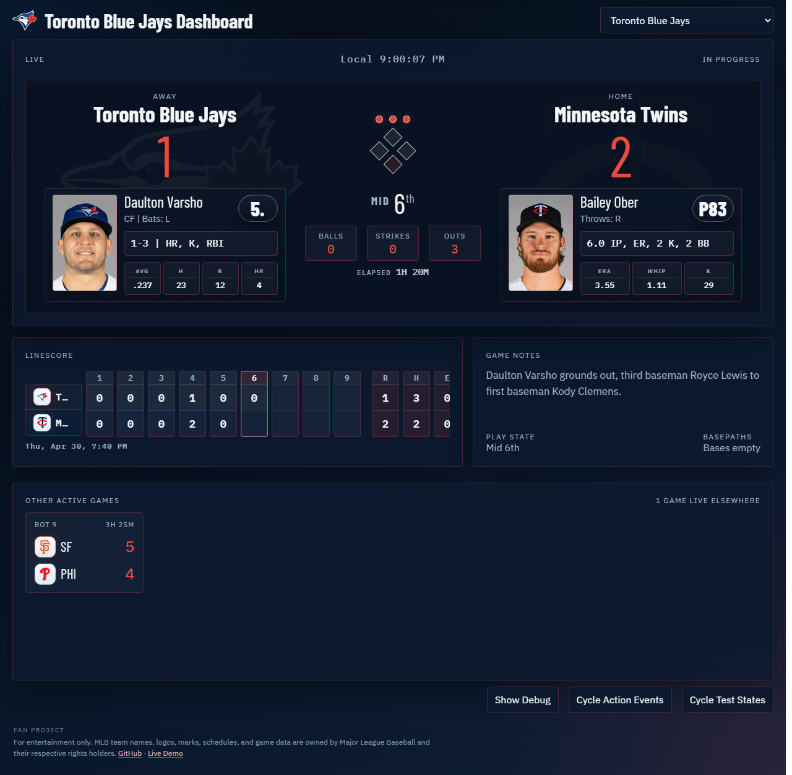
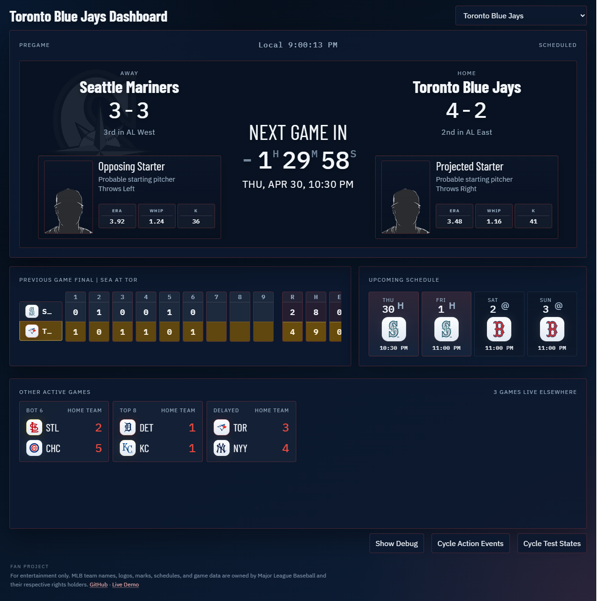
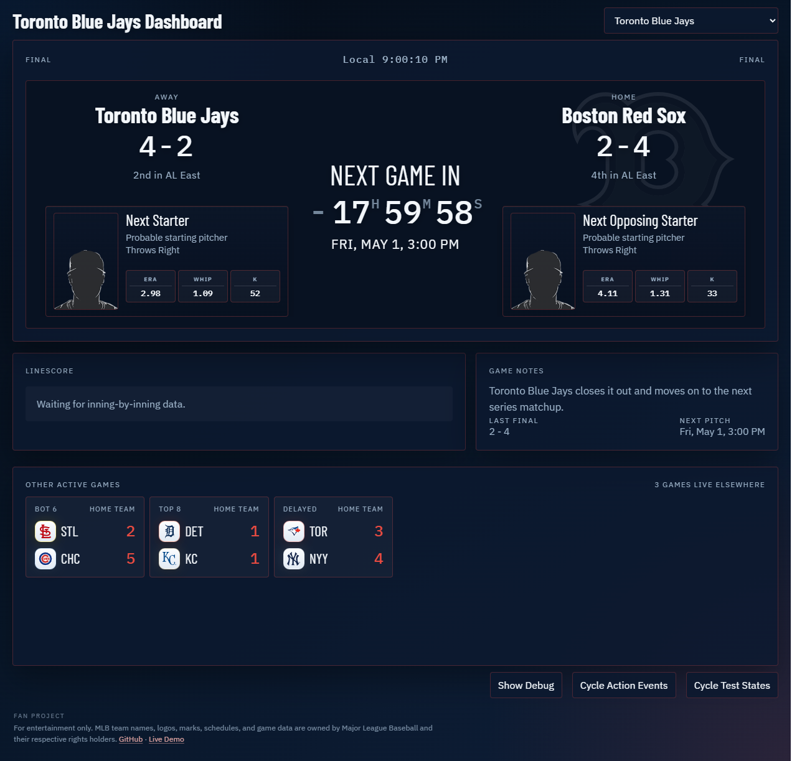

# MLB Realtime Second-Screen Dashboard

An MLB realtime game tracker built as a second-screen experience for following one selected team at a time.

The dashboard is closer to a ballpark display than a traditional stats page: big score state, strong live-game hierarchy, current matchup cards, base/out/count context, linescore, out-of-town scores, and event overlays for important moments.

Live demo: https://mlb.lar.systems/

## Demo Screenshots

Blue Jays state examples captured from the browser app:

### Live



### Pregame



### Final



## Current Features

- Tracks any of the 30 MLB teams, one selected team at a time.
- Persists the selected team and last normalized state in `localStorage`.
- Supports `pregame`, `live`, and `final` runtime layouts.
- Polls MLB data in one Web Worker and normalizes it before the UI renders.
- Shows probable starters, team records, standings snippets, previous game, and upcoming schedule in pregame mode.
- Shows live score, inning, count, outs, bases, batter/pitcher cards, compact live role cards, linescore, recent play, and elapsed game time in live mode.
- Shows final result, summary, winner-aware linescore styling, and next-game context in final mode.
- Includes a full-width scoreboard row for other active games, falling back to recent finals when no other live games are available.
- Lets scoreboard cards switch the tracked team to that card's home team.
- Includes team-specific dark themes, player-photo handling, fallback silhouettes, mock modes, debug state, and action-event overlay previews.
- Uses `build.json` so long-running kiosk tabs can pick up a newer deployed static build during a quiet morning refresh window.

## Architecture

This project stays intentionally simple:

- `index.html` provides the static shell.
- `styles.css` owns the visual system.
- `app.js` owns rendering, timers, persistence, URL parameters, image handling, debug controls, kiosk mode, and worker messaging.
- `mlb-worker.js` owns MLB polling, endpoint fallback logic, event classification, stale-state recovery, and normalization.

The important design rule is that the UI only reads normalized state. Raw MLB payload interpretation stays in the worker so the presentation layer can change without coupling itself to MLB response shapes.

## Runtime Modes

### Pregame

- Shows the next relevant matchup.
- Uses team records in the hero score slots.
- Shows standings text when available.
- Highlights probable starters.
- Surfaces the previous completed game and upcoming schedule.
- Runs a local countdown once the first-pitch timestamp is known.

### Live

- Shows score, inning, balls, strikes, outs, and basepaths.
- Highlights the active batter and pitcher.
- Includes compact hero-side live role cards.
- Includes live linescore, recent play text, and elapsed game time.
- Shows other active league games in a full-width scoreboard row.

### Final

- Shows the completed result and game summary.
- Pivots toward the next scheduled game when available.
- Triggers selected-team win/loss celebration payloads, including a large `WIN THE GAME` treatment for wins.

## Local Setup

### Requirements

- A modern desktop browser.
- A local static server.
- Node.js only if you want to run the optional smoke scripts.

### Run The Dashboard

Serve the project from a local web server. Example:

```powershell
python -m http.server 8080
```

Then open:

```text
http://localhost:8080
```

Do not run the app from `file:///`. Web Workers and some browser features will not behave reliably there.

## URL Options

- `?t=toronto-blue-jays`, `?t=TOR`, or `?t=141`: selects the initial team.
- `?kiosk=1`: enables kiosk-oriented display behavior.

The app keeps the team query parameter in sync when the selector changes.

## Controls

- Team dropdown: switches the tracked club.
- `Cycle Test States`: rotates through mock `pregame`, `live`, and `final` states.
- `Cycle Action Events`: previews overlay moments without waiting for a live feed event.
- `Show Debug` / `Hide Debug`: reveals the normalized state and worker status panel.

## Smoke Checks

These scripts are optional, but useful when changing layout or data flow:

```powershell
npm --prefix tools install
npm --prefix tools run check
npm --prefix tools run smoke:pregame
npm --prefix tools run smoke:live
npm --prefix tools run smoke:final
npm --prefix tools run smoke:dom
```

Notes:

- `tools/smoke-live.cjs` expects a local browser install and a running local site.
- `tools/smoke-test.ps1` is a lighter DOM-based sanity check for `http://localhost/`.

## Cloudflare Pages

The repo root is intentionally kept as a static site so Cloudflare Pages can publish it directly from GitHub without a build step.

Recommended Pages settings:

- Framework preset: `None`
- Build command: leave blank
- Build output directory: `/`

The dev-only smoke tooling lives under `tools/`, and `.assetsignore` keeps that folder out of the published asset bundle.

The root also includes `build.json` plus a `_headers` rule that marks it `no-store`. During an early-morning no-games window, the dashboard checks that manifest and refreshes itself if a newer deployed app version is available. That helps long-running kiosk tabs pick up new releases without forcing a refresh during live play.

If you want Cloudflare Pages to ignore tooling-only commits, use Build watch paths like this:

- Include paths: `*`
- Exclude paths: `tools/*`
- Exclude paths: `README.md`
- Exclude paths: `.gitignore`
- Exclude paths: `.assetsignore`

That setup keeps normal app changes deploying, while README or local-tooling updates do not trigger a new Pages build.

## Project Structure

- `index.html`
  Static DOM shell, dashboard regions, controls, celebration overlay, and footer.

- `styles.css`
  Dashboard layout, theme variables, celebration styling, cards, scoreboard row, debug panel, and responsive behavior.

- `app.js`
  Main-thread controller for rendering, timers, image handling, URL parameters, kiosk mode, build-refresh checks, and local storage.

- `mlb-worker.js`
  Worker-side MLB polling, endpoint fallbacks, event classification, scoreboard summaries, and normalized-state generation.

- `build.json`
  Static app version manifest for deployed refresh checks.

- `_headers`
  Static hosting cache rule for `build.json`.

- `tools/`
  Local-only smoke tests and helper scripts. These are not needed for the live site.

## Tinkering Guide

If you want to change:

- Data sourcing, mode selection, play parsing, event classification, or fallback rules:
  edit `mlb-worker.js`

- Layout, text presentation, timing, celebration display, debug controls, URL handling, or theming:
  edit `app.js` and `styles.css`

- DOM structure or element IDs:
  edit `index.html` and keep `app.js` selectors in sync

- Static deployment refresh version:
  update `build.json`, plus the query-string versions in `index.html` and `app.js`

The codebase carries comments around the areas that are easiest to break while experimenting, especially worker normalization, portrait handling, linescore rendering, active-game cards, and the celebration system.

## Limitations

- This is a browser-first project, so it depends on MLB endpoints remaining accessible from the client.
- Some MLB feeds are inconsistent or temporarily incomplete, which is why the worker has layered live-data fallbacks.
- Player portraits and some live stat fields are not guaranteed for every game state.
- The app is a single-team tracker, not a full league navigation product, even though it can switch among all MLB clubs.

## Disclaimer

This project is an independent fan-made tracker and is not affiliated with or endorsed by Major League Baseball. MLB team names, marks, schedules, logos, and game data belong to their respective owners.
